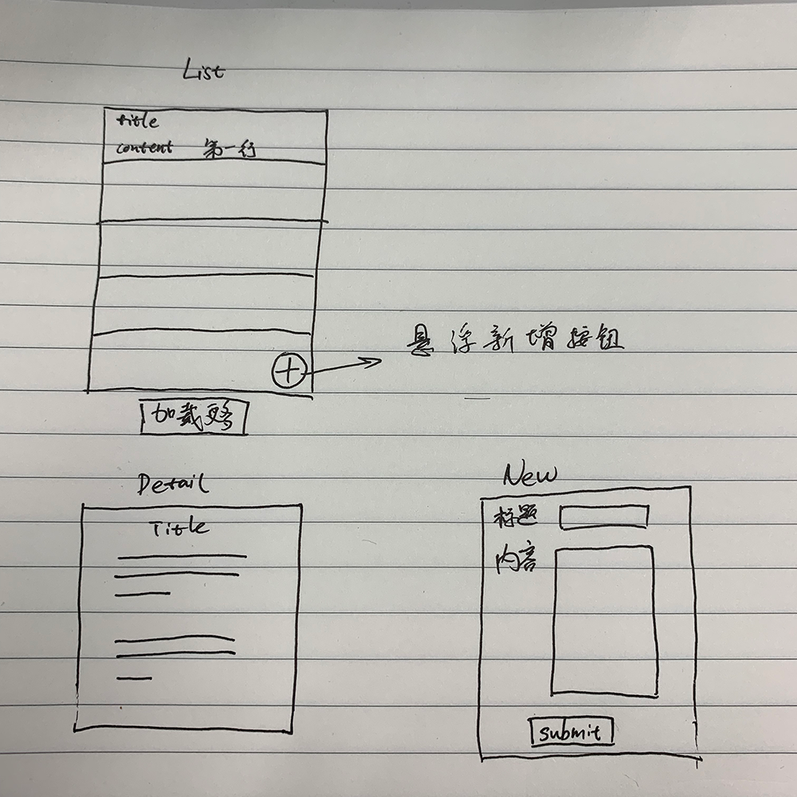

# week2 requirements

- `json-server`
  - 引入 [json-server](https://github.com/typicode/json-server)
  - 新增 `/db` 目录存放 `json-server` 所需本地数据
  - 新增 `npm run api` 命令启动本地模拟接口
- egg.js
  - 新增 `/api` 接口做请求转发
- 引入 vuex / redux 状态管理库
- 增加博客项目逻辑
  - 删除 `report` 相关代码
  - 单篇博客要求字段有：
    - id
    - publishedAt 发布时间
    - title 标题
    - content 内容
  - [http://localhost:7001/](http://localhost:7001/) 打开博客列表页面
    - 列表页面底部有 `加载更多` 按钮
    - 当点击 `加载更多` 按钮时获取下一页博客列表数据
    - 当没有更多数据时，按钮不可点击，文本显示为 `没有更多`
  - [http://localhost:7001/:id](http://localhost:7001/:id) 打开博客详情页面
  - [http://localhost:7001/new](http://localhost:7001/new) 新增博客页面
  - 全局页面的 `loading` 和 `error` 状态提示
- 博客原型如图，具体样式随意
  - 
